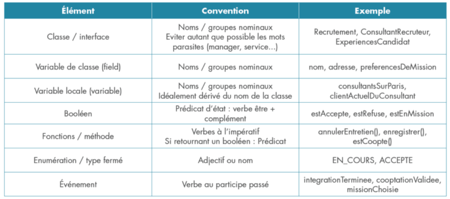

# 🧠 Algorithme

## 📌 Sommaire

- [🚦 Étapes d’un algorithme](#-étapes-dun-algorithme)
- [🧬 Structure de base](#-structure-de-base)
- [📦 Variables](#-variables)
- [🔒 Constantes](#-constantes)
- [📊 Types de données](#-types-de-données)
- [🏷️ Règles de nommage](#-règles-de-nommage)
- [🌍 Portée d’une variable](#-portée-dune-variable)
- [✔️ Bonnes pratiques](#-bonnes-pratiques)
- [📥 Lecture et écriture de données](#-lecture-et-écriture-de-données)
- [🔎 Analyse d’un problème](#-analyse-dun-problème)
- [🧪 Exemple d'énoncé](#-exemple-dénoncé)

---

## 🚦 Étapes d’un algorithme

1. **Préparer les données**
2. **Décomposer le traitement**
3. **Afficher ou retourner le résultat**

---

## 🧬 Structure de base

```pseudo
ALGORITHME NomAlgorithme
// Description rapide ici
DEBUT
  afficher("Hello world!")
FIN
```

---

## 📦 Variables

> Une variable, c’est une petite boîte mémoire temporaire pour stocker des infos 🔁

### 🔹 Déclaration simple

```pseudo
VARIABLE nomDeVariable : Type
```

### 🔹 Plusieurs variables du même type

```pseudo
VARIABLE age, taille : entier
```

### 🔹 Types variés

```pseudo
VARIABLE age, taille : entier
         nom, prenom : chaîne de caractères
```

---

## 🔒 Constantes

> Les constantes sont des valeurs **figées**. Tu les déclares une fois, elles bougent plus 💎

```pseudo
CONSTANTE nomConstante : Type <- valeur
```

### Exemple :

```pseudo
CONSTANTE max : entier <- 10
          maxFoisDeux : entier <- max * 2
```

---

## 📊 Types de données

| Type                     | Description                          |
| ------------------------ | ------------------------------------ |
| **Entier**               | Nombres sans virgule                 |
| **Réel**                 | Nombres avec virgule                 |
| **Booléen**              | `VRAI` ou `FAUX`                     |
| **Chaîne de caractères** | Textes (lettres, chiffres, symboles) |

---

## 🏷️ Règles de nommage

Un bon nom, c’est la base d’un code clean ✨

1. Commence par une **lettre** ou un **underscore**
2. Pas de tiret `-`, ni de point `.`
3. Pas de mots-clés (`pour`, `tant que`, etc.)
4. **Sensible à la casse** → `maVar` ≠ `mavar`
5. Utilise le **camelCase** pour plusieurs mots (`maSuperVariable`)
6. Nom clair = code compréhensible
7. **Facile à lire & prononcer**
8. **Court mais expressif**

---

## 🌍 Portée d’une variable

> La **portée** (_scope_) d'une variable définit où tu peux l’utiliser dans ton code.

- Si elle est déclarée **dans un bloc**, elle n'existe que là.
- Si elle est **globale**, elle peut être utilisée partout.
- Toujours donner des noms explicites 🙌

---

## ✔️ Bonnes pratiques



---

## 📥 Lecture et écriture de données

### 🔹 Lecture (saisie utilisateur)

```pseudo
saisir(nomDeLaDonnée)
```

### 🔹 Écriture (affichage)

```pseudo
afficher(nomDeLaDonnée)
```

### 🔹 Exemple

```pseudo
saisir(unNombre)
afficher("Le nombre est :", unNombre)
```

---

## 🔎 Analyse d’un problème

L’analyse, c’est le moment où tu **décryptes l’énoncé** comme un détective 🔍

Repère et surligne :

- ✅ Le **but** du programme (le traitement à réaliser)
- 📥 Les **données d’entrée**
- 📤 Les **résultats attendus**

---

## 🧪 Exemple d’énoncé

> On souhaite calculer et afficher, à partir d’un **prix hors taxe saisi**, la **TVA** ainsi que le **prix TTC**.

### Le montant TTC dépend de :

- 💸 Le **prix HT**
- 📈 Le **taux de TVA** (ici, 20%)
